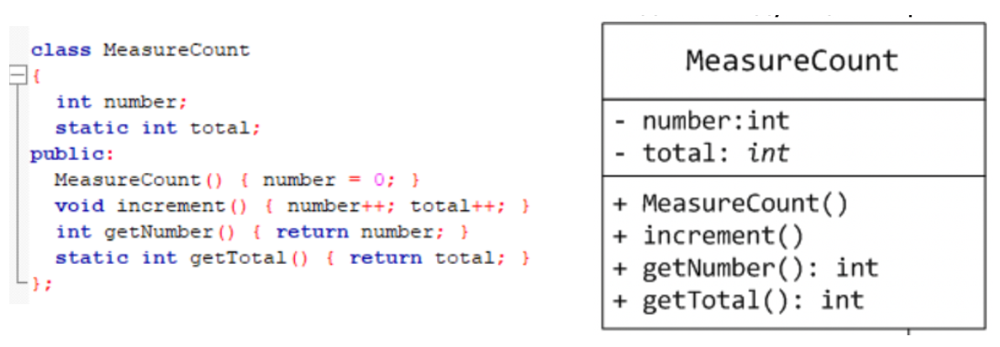
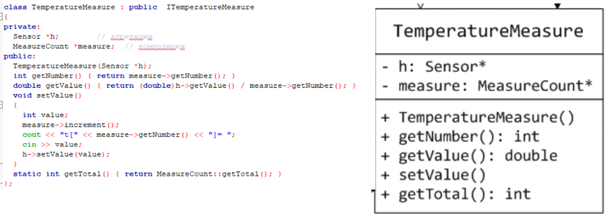
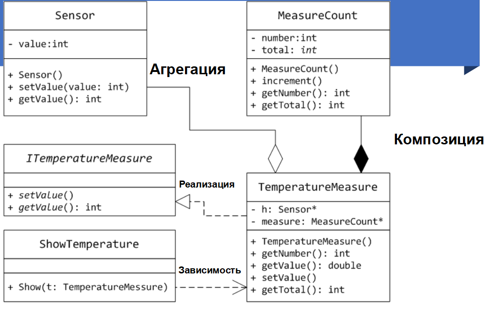

# Продолжение диаграммы классов 
Чисто накидали примеры из презы с некоторыми не особо важными объяснениями.

Поставленная задача:

*Программа получает данные о количестве измерений каждого из датчиков температуры (вводятся с консоли).Далее, программа получает каждое измерение датчика (вводятся с консоли). На экран выводится усредненное значение температуры.*
```c++
class Sensor { 
    int value;
public:
Sensor(){ value = 0; }
void setValue (int value) { this->value += value; } 
int getValue() { return value; }
}
```





Пример полных связей и взаимосвязей



# Абстрактные классы и Виртуальные функции
Встречаються в 5 и 6 лабах вроде
## Виртуальные функции (ВФ)

Что такое виртуальная функция?
Это функция которая в дочерних классах переопредеяется.

Используется тогда, когда в дочернем классе требуеться свой вариант этой функции.
### Полиморфизм
Полиморфизм - возможность функции изменять возвращаемое значение
Классы которые включают такие функции - полиморфы

`ПОЛИМАРФИЗМ = НАСЛЕДОВАНИЕ + ВФ`

Виртуальные функции(ВФ) используют механизм `позднего/отложенного/динамического связывания`

Полиморфизм – это свойство программного кода изменять свое поведение в зависимости от ситуации, возникающей при выполнении программы (один интерфейс - множество реализаций).

В контексте реализации программы полиморфизм – это технология вызова виртуальных функций, реализуемых в иерархически связанных классах. Иерархия классов формируется на базе механизма наследования.

Полиморфные функции - функции, способные обрабатывать данные разных типов.

## СВОЙСТВА ВФ

- ВФ функции могут быть как в базовом так и в дочерних классах
- если ВФ в дочернем классе не переопределяется в базовом классе то она останется виртуальной.
- Если переопределяется ВФ в виртуальных классах то она становиться не виртуальной. (т.е. перестаёт быть виртуальной после первого переопределения)

**Пример**
```c++

```

### Раннее и позднее связывание
Раннее связывание это когда объект и функция связаны на этапе коипиляции.

(Вызовы, рекурсии, перегруженные операторы и т.п.)

Позднее связывание это когда объект и функция связывается только во время исполнения проги. Связывание происходит через ВФ
(большая гибкость за счёт чего разные объекты могут иметь собственный интерфейс, ну а так же могут быть поддержаны и общим интерфейсом)

**Пример**

```c++

```

## Переопределение виртуальной функции

Динамический полиморфизм - использование наследования классов в сочетании с виртуальными функциями (позднее/динамическое связывание).

Чтобы в производном классе переопределить виртуальную функцию базового класса, можно в конце объявления функции в производном классе указать идентификатор override (переопределение).

**Пример**

```c++

```

Виртуальными функциями могут быть только нестатичкие функции т.к. статически определяються лишь один раз

## Чисто ВФ функция

Чистые виртуальные функции - функции, которые не имеют определения.

Обычная виртуальная функция превращается в чистую, если в конец объявления виртуальной функции добавить "= 0":
**Пример** 
```c++
class Object { // определяем абстрактный класс Object
    public:
    Object (){}
    ~Object(){}
    virtual void output () = 0 // чисто ВФ
}

```

При создании классов-наследников все они должны либо определить для чистых виртуальных функций конкретную реализацию, либо повторить объявление чистой виртуальной функции. Во втором случае производные классы также будут абстрактными.
Пример
```c++

class Shape { //определяем абстрактный базовый класс Shape (форма)
public:
};
virtual double get_square() = 0; //объявляем чистую виртуальную функцию get_square() 
virtual void show_type() = 0; //объявляем чистую виртуальную функцию show_type()
class Rectangle : public Shape { //определяем класс-наследник Rectangle (прямоугольник) базового класса Shape 
private:
double width; //поле для хранения значения ширины
double length; //поле для хранения значения длины
public:
Rectangle(double w, double 1) { //конструктор с параметрами
}
width = w; length = 1;
double get_square() override { //делаем переопределение виртуальной функции get_square с помощью идентификатора override (переопределить) 
return (width * length); //возвращаем значение площади прямоугольника
}
void show_type() override { //делаем переопределение виртуальной функции show_type с помощью идентификатора override 
cout << "\nIt's a rectangle";
}
class Quad : public Shape { //определяем класс-наследник Quad (квадрат) базового класса Shape private:
double side; // поле для хранения значения стороны квадрата
public:
Quad(double s) { //конструктор с параметрами
}
side = s;
double get_square() override { //делаем переопределение виртуальной функции get_square с помощью идентификатора override (переопределить) return (side * side);
}
void show_type() override { //делаем переопределение виртуальной функции show_type с помощью идентификатора override
cout << "\nIt's a quad";
}
};
};
```
## Абстрактный класс (АК)
Класс который наследует хотя бы одну ВФ без переопределения

### Правила АК
- Абстрактный класс нельзя использовать при явном приведении типов, для описания типа параметра и типа возвращаемого функцией значения.

- Допускается объявлять ссылки и указатели на классы-наследники абстрактного класса.

- Если класс, производный от абстрактного, не определяет все чистые виртуальные функции, он также является абстрактным.

## Виртуальный деструктор
**ПРИМЕР**
```c++
#include <iostream>
 
using namespace std;
 
// Вспомогательный класс
class Object  
{
  public:
    Object() { cout << "Object::ctor()" << endl; }
   ~Object() { cout << "Object::dtor()" << endl; }
};
 
// Базовый класс
class Base 
{
  public:
    Base() { cout << "Base::ctor()" << endl; }
    virtual ~Base() { cout << "Base::dtor()" << endl; } 
    virtual void print() = 0;
};
 
// Производный класс
class Derived: public Base 
{
  public:
    Derived() { cout << "Derived::ctor()" << endl; }
   ~Derived() { cout << "Derived::dtor()" << endl; }    
    void print() {}   
    Object  obj;
};
 
int main ()
{
    Base * p = new Derived;
    delete p;
    return 0;
}
```

В языке программирования C++ деструктор полиморфного базового класса должен объявляться виртуальным. Только так обеспечивается корректное разрушение объекта производного класса через указатель на соответствующий базовый класс.

В функции main указателю на базовый класс присваивается адрес динамически создаваемого объекта производного класса Derived. Затем через этот указатель объект разрушается. При этом наличие виртуального деструктора базового класса обеспечивает вызовы деструкторов всех классов в ожидаемом порядке, а именно, в порядке, обратном вызовам конструкторов соответствующих классов.

Вывод программы с использованием виртуального деструктора в базовом классе будет следующим:

```c++
Base::ctor()
Object::ctor()
Derived::ctor()
Derived::dtor()
Object::dtor()
Base::dtor()
```
Уничтожение объекта производного класса через указатель на базовый класс с невиртуальным деструктором дает неопределенный результат. На практике это выражается в том, что будет разрушена только часть объекта, соответствующая базовому классу. Если в коде выше убрать ключевое слово virtual перед деструктором базового класса, то вывод программы будет уже иным. Обратите внимание, что член данных obj класса Derived также не разрушается.

```c++
Base::ctor()
Object::ctor()
Derived::ctor()
Base::dtor()
```
Когда же следует объявлять деструктор виртуальным? Cуществует правило - если базовый класс предназначен для полиморфного использования, то его деструктор должен объявляться виртуальным. Для реализации механизма виртуальных функций каждый объект класса хранит указатель на таблицу виртуальных функций vptr, что увеличивает его общий размер. Обычно, при объявлении виртуального деструктора такой класс уже имеет виртуальные функции, и увеличения размера соответствующего объекта не происходит.

Если же базовый класс не предназначен для полиморфного использования (не содержит виртуальных функций), то его деструктор не должен объявляться виртуальным.


## Лабораторная работа №5

Постановка задачи:
1. Определить абстрактный класс
2. Определить иерархию классов, в основе которой будет находиться абстрактный класс (иерархия классов берется из лабораторной работы №4)
3. Определить класс Вектор, элементами которого будут являться указатели на объекты иерархии классов
4. Перегрузить для класса Вектор операцию вывода объектов с помощью потоков
5. В основной функции продемонстрировать перегруженные операции и полиморфизм класса Вектор.

Базовый класс: ЧЕЛОВЕК (PERSON) Имя (name) - string

Возраст (age) - int

Определить методы изменения полей.

Создать производный класс ТЕАСHER, имеющий поля Предмет - string и Количество часов - int. Определить методы изменения полей, а также увеличения и уменьшения часов.

# Абстрактные типы данный, Контейнеры

## Абстрактные типы данных(АТД)

Абстракция - процесс изменения подробностей программы за счёт упращения. Когда мы абстрагируемся от проблемы, мы предполагаем игнорирование ряда подробностей с тем, чтобы свести задачу к более простой.

**Пример:**
использование функций и классов, реализованных в сторонней библиотеке

АТД - Модель для типов данных, где тип определяется его поведением.
Представление типа данных в виде 
- списка операций
- Без способов реализации этих операций

## Параметризация данных(абстракция через параметризацию)
Это такая абстракция через параметры и структуры без привязки к типам данных

## Абстракция через спецификацию

Абстракция через спецификацию (АС) позволяет абстрагироваться от процесса вычислений, описанных в теле процедуры, до уровня знания того, что данная процедура должна в итоге реализовать. Это достигается путем задания для каждой процедуры спецификации, описывающей эффект ее работы. При этом смысл обращения к процедуре становится ясным через анализ ее спецификации, а не тела процедуры.

Спецификация - описание того как должна работать функция и что она должна реализовать.

Требования к АТД
1. АТД должен уметь работать только со своими данными.(Очередь - первяй пришёл, первый ушёл)
2. АТД не должны зависеть от внешнего состояния приложения.(таже очередь, удаляй и добавляй эллементы, но всё должно работать чётко!)
3. Для того, чтобы получить данные используйте методы для доступа к данным или классы реализующие такую возможность.(так же как и в классе используется определённые способы доступа к АТД соответствующими методами(какие то геттеры и сетторы хз шо такое))

## Различие АТД и структурам данных
Структура - это реализация, которую пользователь хотели выполнить(внутри)ЧТО?

АТД - это описание того что мы хотим реализовать.(Оболочка)КАК?
 
## Плюсы АТД

1. Инкапсуляция деталей реализации.
2. Снижение сложности за счёт декомпазиции.
3. Ограничение области использования данных.(использование не для каждого класса)
4. Высокая информативность интерфейса за счёт отсутсвия мелкой детализации.

# Контейнеры
Контейнер – набор однотипных элементов. 

Встроенные массивы в С++ - частный случай контейнера.

Контейнер – это объект. Имя контейнера – это имя переменной.

## Свойства контейнеров
1. Контейнер, так же как и другие объекты, обладает временем жизни. Время жизни контейнера в общем случае не зависит от времени жизни его элементов.
(время жизни может не совпадать с временем жизни элементов контейнера)

2. Элементами контейнера могут любые объекты, в том числе, и другие контейнеры.(шалкер в шалкер и ещё раз в шалкер и того стив несёт на себе целую землю)

3. Контейнеры могут быть фиксированного и переменного размера. В контейнере фиксированного размера число элементов постоянное, оно обычно задается при создании контейнера.

## Виды контейнеров
`LIFO` (Last In First Out - последним пришел первый вышел) - вставка и удаление осуществляется на одном конце.

`FIFO`(First In First Out - последним пришел последним вышел) - вставка и удаление осуществляется на разных концах(очередь)

## Операции контейнеров 
1. Операция доступа к элементам(замена значений)
2. Операция добавления (Добавление и удаление элеменов или групп)
3. Операция поиска(элементов или групп)
4. Операция объединения контейнеров
5. Спец операции (зависят от вида контейнера)(матрицы мы можем найти определитель, когда в других контейнерах это низя)

## Итераторы
`В первую очередь ЭТО АТД!`

Итератор (от англ. iterator ― перечислитель) — интерфейс, предоставляющий доступ к элементам коллекции(массива или контейнера) и навигацию по ним.

**Главное предназначение итераторов** заключается в предоставлении возможности пользователю обращаться к любому элементу контейнера при сокрытии внутренней структуры контейнера от пользователя. Это позволяет контейнеру хранить элементы любым способом при допустимости работы пользователя с ним как с простой последовательностью или списком. 

{обращение к любому элементу без привязки к структуре контейнера(которая инкапсулирована)
Хранение элементов любым способом(список, последовательность и д.р.)} СЛОВА ОЛЬГИ АНДРЕЕВНЫ

## Свойства Итераторов
1. Итератор указывает на отдельный элемент коллекции объектов (предоставляет доступ к элементу) 

2. Содержит функции для перехода к другому элементу списка (следующему или предыдущему). 

3. Контейнер, который реализует поддержку итераторов, должен предоставлять первый элемент списка, а также возможность проверить, перебраны ли все элементы контейнера (является ли итератор конечным)


## Лабораторная работа №6


1. Определить класс-контейнер.
2. Реализовать конструкторы, деструктор, операции ввода-вывода, операцию присваивания.
3. Перегрузить операции, указанные в варианте.
4. Реализовать класс-итератор. Реализовать с его помощью операции
последовательного доступа.
5. Написать тестирующую программу, иллюстрирующую выполнение операций.


Класс- контейнер СПИСОК с ключевыми значениями типа int. Реализовать операции:
[] - доступа по индексу;
int() - определение размера списка;
* вектор - умножение элементов списков a[i]*b[i];
+n - переход вправо к элементу с номером n ( с помощью класса-итератора).


# Шаблоны функций и шаблоны классов
## Шаблоны
Создание функций или классов которые работают с разными типами данных

### Свойства Шаблонов
- Создают семейства функций и классов
- Создание функций и классов автоматизируется(единый алгоритм) для данных разного типа
- Конкретный тип данных, над которым выполняется операция передаётся в шаблон в качестве параметра. 
- Шаблонные функции или классы называются параметризованными.
- Семейство позволяет работать с разными типами данных по единой логике (алгоритму) – обобщенное программирование.

### Шаблоны функций
Обобщённое описание функции без типа данных. Тип передаётся как параметр, компилятор генерит функцию для этого типа

### Создание Шаблона функции
1. Описание любого шаблона начинается с ключевого слова template.

2. Параметры (аргументы) шаблона перечисляются в угловых скобках <…>.

3. Параметры шаблона обозначают типы данных, поэтому каждому параметру должно предшествовать ключевое слово typename или class. (Ключевое слово typename говорит о том, что в шаблоне будет использоваться встроенный тип данных. Ключевое слово class сообщает компилятору, что в шаблоне функции в качестве параметра будут использоваться пользовательские типы данных.)

4. Параметров шаблона может быть несколько.

### Компилятор и шаблоны
- Когда компилятор видит ключевое слово template и следующее за ним определение функции запоминает шаблон для будущего использования. Дело в том, что сам по себе шаблон не вызывает генерацию компилятором какого-либо кода, поскольку еще не знает, с каким типом данных будет работать данная функция. 

- Генерации кода не происходит до тех пор, пока функция не будет реально вызвана в ходе выполнения программы.

- При первом вызове функции с конкретными типами параметров компилятор построит функцию с параметрами этого типа.

- Окончательный код программы не содержит шаблонов, а содержит реальные функции сгенерированные компилятором.

### Свойства параметров шаблона функции
- В списке параметров шаблона может быть несколько параметров, каждому предшествует ключевое слово typename или class. //template <class T1, T2>
- Имя параметра шаблона имеет в определяемой шаблоном функции все права имени типа, то есть с его помощью могут специализироваться формальные параметры,определяться тип возвращаемого функцией значения и типы любых объектов, локализованных в теле функции.
- Параметризированная функция может иметь сколько угодно непараматризированных формальных параметров.
- Имена параметров в шаблоне не обязаны совпадать с именами в самом шаблоне.
- При конкретизации шаблонного определения функции необходимо, что бы при вызове функции типы физических параметров, соответсвующие одинаково параметризованным формальным параметрам были одинаковы.
```c++
#include <iostream> 
using namespace std;

template <typename Type> 
Type abs (Type n)
{ if (n > 0)
     return n;
   else
     return -n;
}
int main()
{
int a = 5;
int b = -6;
double c = 3.14;
double d = -6.626
cout << "abs(" << a <<"( =" << abs(a) << endl;  
cout << "abs(" << b <<"( =" << abs(b) << endl;
cout << "abs(" << c <<"( =" << abs(c) << endl;
cout << "abs(" << d <<"( =" << abs(d) << endl;
return 0;
}
```

### Перегрузка шаблонов


## Лаба №7

