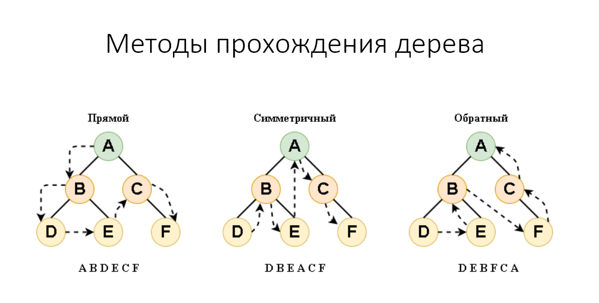

# Бинарные деревья
1. неленейная структура
2. форма представления - связанные узлы

Дерево – это множество данных, представляющее собой древовидную структуру в виде набора связанных узлов. Является нелинейной структурой

Узел – это единица хранения данных в дереве, имеющая также указатели на связанные с ней узлы.

Дочерний узел (потомок) – это узел, который находится непосредственно под другим узлом и связан с ним с помощью указателя.

Родительский узел – это узел, который находится непосредственно над другим узлом и связан с ним с помощью указателя.

Корневой узел – это узел, не имеющий родительских узлов.

Лист – это узел, не имеющий дочерних узлов.

Расположение информации, связанной между собой некой иерархией. Примером является файловая система компьютера.

Хранение данных, составленных в виде определённой структуры. 

Хранение данных в виде бинарного дерева позволяет уменьшить время поиска информации.

Обеспечение высокой скорости добавления или удаления данных.

Хранение заранее неизвестного объема данных. Бинарные деревья, также, как и связанные списки, не имеют ограничения на количество узлов, поскольку они связаны указателями.

Используется в алгоритмах сжатия таких форматов файлов, как .jpeg и .mp3

Используется в трехмерных видеоиграх. Например, для обнаружения столкновений

Бинарное дерево называется идеально сбалансированным (ИСД), если для каждого его узла количество узлов в левом и правом поддеревьях отличается не более чем на единицу. Идеально сбалансированное дерево из n узлов имеет минимальную высоту для бинарного дерева, которая вычисляется по формуле: [log2n] + 1.

Бинарное дерево поиска — это бинарное дерево, обладающее дополнительными свойствами: значение левого потомка всегда меньше значения родителя, а значение правого потомка всегда больше значения родителя для каждого узла дерева.

