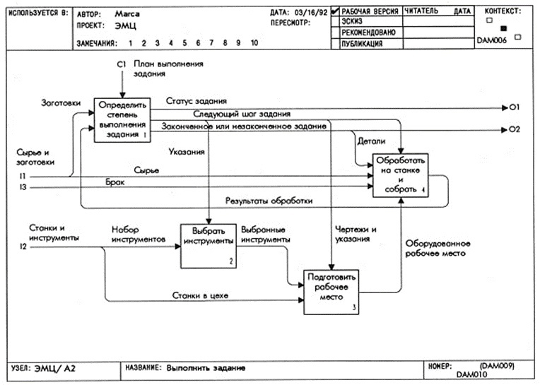

# Диаграммы функционального моделирования SADT(IDEF0)
SADT - Способ описания объекта(системы) которая позволяет выделить блоки `активностей`(отвечают за этапы работы системы) и `связи`(дуги) которые связывают блоки `активностей`

Результат - получение модели системы для выстраивания алгоритма управления.

SADT - Метотология структурного анализа и проектирования.

## Этапы построения моделей

1. Сбор Информации
- опрос по фактам
- определеение проблем
- принятие решений
2. Определения цели и средства её достижений
3. Декомпозиция(разбивка на уровни управления) и построение диаграмм
4. Критическая оценка, рецензирование, комментирования.
5. Признаки завершения декомпозиции - полнота модели.
- определения дополнителных возможностей для лушчей детализации модели(абстрактная модель не читабельна т.к. малопонятна)
- блоки моделей не повторяються
- чем более лёгкую функцию использует блок тем быстрее модель превратиться в программу

## Правила составления программ SADT
 
 1. состав: Блоки(функции), дуги(действия/связи(могут изображать действия которые передаються от блоков к блоку))

## Изображения SADT моделей

Левая сторона - входные параметры
правая сторона - выходные параметры
Снизу - механизмы ( средства обеспечивающие работу конкретного блока)
сверху - управление

Диагаммы SADT рапологаються в виде уровней для упрощения чтения диаграмм    

ЗАДАЧА!!!
дано предприятие - выполнить задание по выпуску детали.

# Структуры в C++

Структура - тип данных который создаёт пользователь: Имеет имя, структурирует разные типы переменных в одно целое

Пример(студен - фио группа дата рождения)

Поля структуры это переменные с их свойствами, которые входят в структуру, функции которые называються методами.

Виды полей 
Переменные
структура
массив
указатель

поле структуры не совподает по стипу с самой структурой Но указатель на само структуру используется

обращение к структуру -> 

Перед вашими глазами представлена краткая модель IDEF0 Тренировка спортсмена. В качестве входных данных здесь представленны виды упражнение, физ показатели и состояние человека, в качестве ограничений техника упражнение, техника безопасности и расчёт статистики. В качестве механизма представленны тренер, спортсмен и мобильное устройство. На выходе же мы получаем отчёт о проделанной тренировке и статистику.

В полной модели пунктом отправления является анализ данных спортсмена в качестве входных данных в него поступают физические показатели и состояние человека в качестве ограничений в него поступает техника безопасности, в качестве выходных данных мы получаем состояние спортсмена, которые являються входными данными для блока разработки плана тренировки, так же к этому блоку входными данными являються ё

